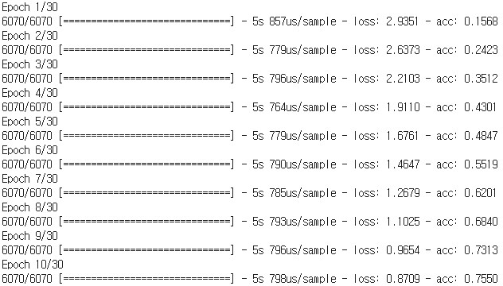

Text Generation using Keras Char RNNLM
===========================================

Keras implementation of Character-Level Recurrent Neural Network Language Model.  
https://www.cs.utoronto.ca/~ilya/pubs/  
Using About Wikipedia page.  
https://en.wikipedia.org/wiki/Wikipedia:About
	
    Generating Text with Recurrent Neural Networks
    Ilya Sutskever, James Martens, and Geoffrey Hinton
    International Conference on Machine Learning (ICML), 2011

Training Usage
-----

    python TrainingModel.py train_data_file output_model_file output_char_to_index_file

    ex)
    python TrainingModel.py ./data/train_data.txt ./model/rnnlm_model.h5 ./model/char_to_index.pickle

Training Result
-----

Generation Usage
-----

    python PredictSentence.py input_model_file input_char_to_index_file "input_sentence" output_char_count

    ex)
    python PredictSentence.py ./model/rnnlm_model.h5 ./model/char_to_index.pickle "wikipedia is" 30

Generation Result
-----

